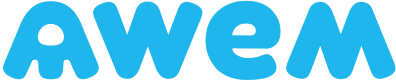
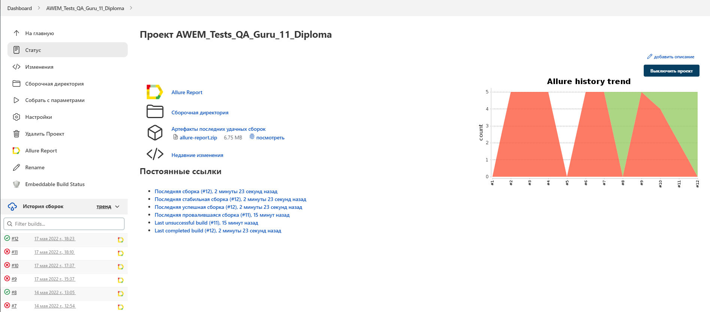
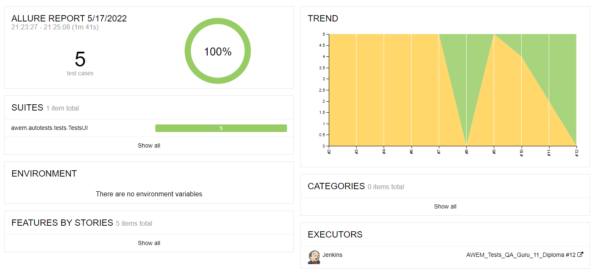
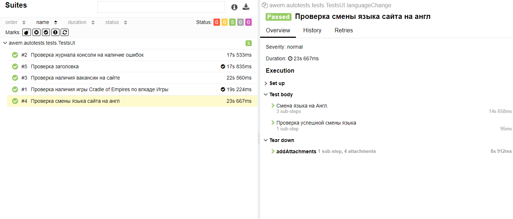
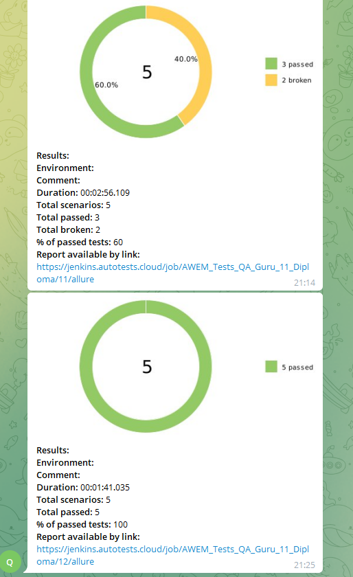

# Проект по автоматизации тестирования awem.com
<a href="https://awem.com/"></a>

## :scroll: Структура:

- <a href="#toolbox-технологии-и-инструменты">Стек</a>
- <a href="#arrow_forward-проведенные автотесты">Автотесты</a>
- <a href="#bar_chart-сборка-в-Jenkins">Сборка в Jenkins</a>
- <a href="#outbox_tray-запуск-из-терминала">Запуск из терминала</a>
- <a href="#loudspeaker-allure-отчет">Allure отчет</a>
- <a href="#robot-отчет-в-telegram">Отчет в Telegram</a>
- <a href="#film_strip-видео-примеры-прохождения-тестов">Видео примеры прохождения тестов</a>


## :toolbox: Стек:
<p align="center">


</p>

## :arrow_forward: Автотетсы
-Проверка наличия Title (работоспособность главнйо страницы)
-Проверка возомжности смены языка
-Проверка наличия игры Cradle of Empires по влкаде "Игры"
-Проверка журнала консоли на наличие ошибок
Проверка наличия вакансии на сайте

## :bar_chart: Сборка в Jenkins
## <a target="_blank" href="https://jenkins.autotests.cloud/job/AWEM_Tests_QA_Guru_11_Diploma/">Сборка в Jenkins</a>
<p align="center">

</p>

## :hammer_and_wrench: Параметры сборки в Jenkins:

- repository (возможность сборки со своим репозиторием)
- browser (браузер, по умолчанию chrome)
- version (версия браузера, по умолчанию 100.0)
- size (размер окна браузера, по умолчанию 1920x1080)
- browsermobile (возможность запуска в мобильном браузере)
- remoteUrl (адрес удаленного сервера selenoid)
- threads (количество потоков, по умолчанию 1)
- allure notification version (выбор версии Allure Notification, по умолчанию 2.2.3)

## :outbox_tray: Запуск из терминала
Локальный запуск:
```
gradle clean test
```

Удаленный запуск:
```
clean
test
-Duser=${USER}
-Dpassword=${PASSWORD}
-Dbrowser=${BROWSER}
-DremoteDriverUrl=https://${USERNAME}:${PASSWORD}@${REMOTE_DRIVER_URL}/wd/hub/
-DbrowserVersion=${BROWSER_VERSION}
-DbrowserSize=${BROWSER_SIZE}
-DbrowserMobileView="${BROWSER_MOBILE}"
-Dthreads=${THREADS}
```
## :loudspeaker: Allure отчет
- ### Главный экран отчета
<p align="center">

</p>

- ### :clipboard: Страница с проведенными тестами
<p align="center">

</p>

## :robot: Отчет в Telegram
<p align="center">

</p>

## :film_strip: Видео примеры прохождения тестов
> К каждому тесту в отчете прилагается видео. Одно из таких видео представлено ниже.
<p align="center">
  
</p>